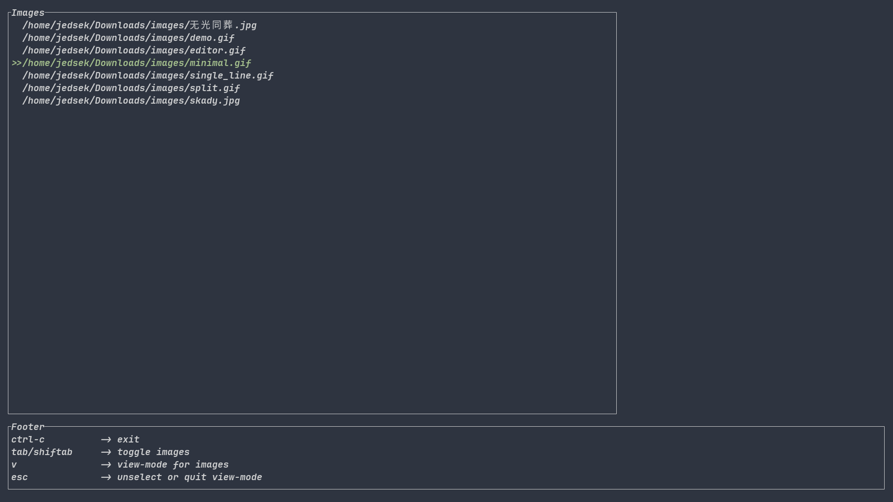

# tuimager
It is a tui image viewer based on kitty/iterm graphic protocols.  
For Chinese, you could view [my blog](https://jedsek.xyz/categories/rust-tui) about using ratatui-rs to write this simple project.  

**Note:**  
Your terminal should support kitty/iterm graghpic protocols like `kitty/wezterm`.  


## Showcase




## Installation

### Manual

```bash
git clone https://github.com/jedsek/tuimager ./tuimager
cargo install --path ./tuimager
```

### Release
You could download the binary published in [Release](https://github.com/Jedsek/tuimager/releases/)

Thanks!